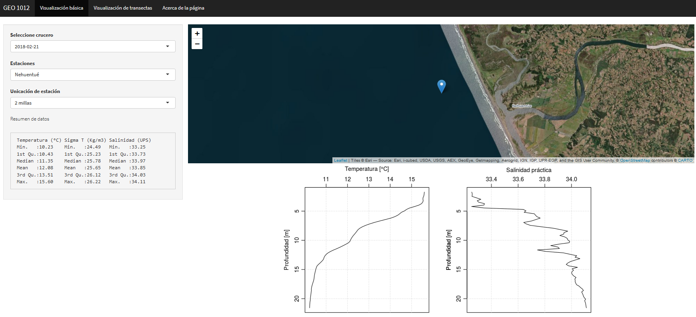

# oceData app
> Shiny app for oceanographic profiles and section data visualization.

Shiny app developed for undergraduate teaching course: Litoral and Oceanic Geoghraphy GEO 1012, Geography Institute, Pontifical Catholic University of Valparaíso.-




## URL
You can visit this app in : [oceDataApp](https://labgrs.shinyapps.io/oceData/)

## Local run 

RStudio:

```sh
runUrl('https://github.com/JoseLastra/oceDataApp/archive/master.zip')
```

## Meta 📋

MSc. José A. Lastra – [@JoseLastra](https://twitter.com/JoseLas08799165) – jose.lastra@pucv.cl

Distributed under the XYZ license. See ``LICENSE`` for more information.

## Developed with 🛠️

_Menciona las herramientas que utilizaste para crear tu proyecto_

* [shiny](https://www.shinyapps.io/) - El framework web usado
* [oce](https://dankelley.github.io/oce/) - Manejador de dependencias

## Log 
* Version 0.1.- May 2020: visualizing profiles from CTD and make sections views based on static data.


